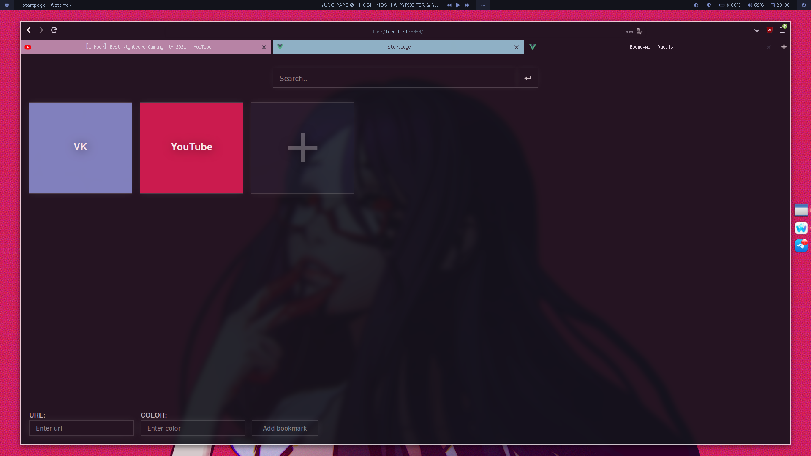

# Firefox theme

## Install & configuration instructions

## Before installing the theme:

- Go in the "Customize" section of firefox and set "Density" to "Compact".
- [Enable userChrome.css in about:config](https://www.youtube.com/watch?v=levqpofIJ_k&feature=youtu.be)

To install the theme:

1. Go to `about:support` in Firefox.
2. Application Basics > Profile Directory > Open Directory.
3. Open directory in a terminal.
4. Create a chrome directory if it doesn't exist:

`mkdir -p chrome`
`cd chrome`

5. Copy the userChrome.css file from this repository to that folder

For best results, install the Rubik font
